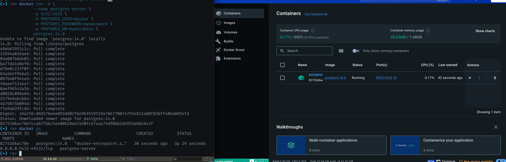

Reference: https://mlops-for-mle.github.io/tutorial/docs/database/db-server-creation
###
### DB 서버 생성
```
  docker run -d \
  --name postgres-server \
  -p 5432:5432 \
  -e POSTGRES_USER=myuser \
  -e POSTGRES_PASSWORD=mypassword \
  -e POSTGRES_DB=mydatabase \
  postgres:14.0
```



### DB 서버 확인
