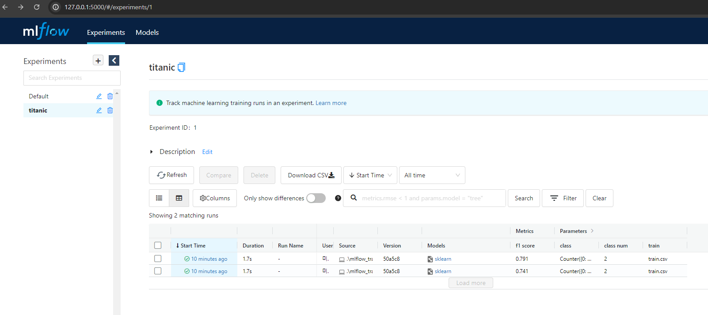
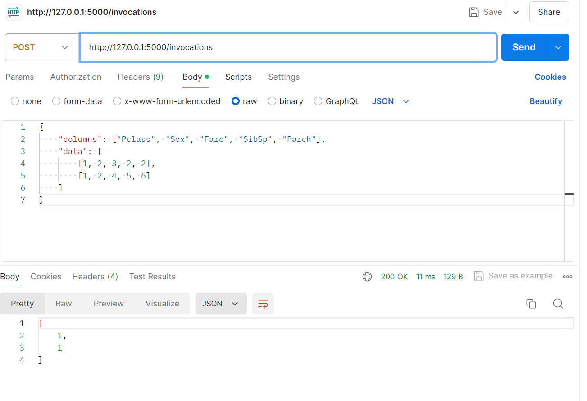

## Reference
https://pseudolab.github.io/mlflow_%ED%8A%9C%ED%86%A0%EB%A6%AC%EC%96%BC/  
https://github.com/vhrehfdl/mlflow_tutorial

## library version issues  
* numpy==1.23.4
* protobuf==3.20.0

## mlflow_tranking
```python
cd ML
mlflow ui
mlflow ui -h {ip} -p {port}
```
> the set_tracking_uri does not work (line:44 in mlflow_tracking.py)  
> so I changed the order

```python
cd ML
python mlflow_tracking.py
```



## mlflow_inference
```python
python mlflow_inference.py
```

### simple serving example
```python
mlflow models serve -m runs:/{run_id}/ {folder_name} --no-conda
# in my case
mlflow models serve -m runs:/b354bd8db7894598a962c26c475de872/titanic_model --no-cond
```



## MLProject
```python
mlflow experiments create --experiment-name {projectname}
# >> Created experiment 'lsh123' with id 2
mlflow experiments list
# >> Experiment Id  Name     Artifact Location
# ---------------  -------  -----------------------------------------------------------------------------------------
#               0  Default  {path}\MLflow\0_tutorial\mlflow_tutorial\ML\mlruns\0
#               1  titanic  {path}\MLflow\0_tutorial\mlflow_tutorial\ML\mlruns\1 
#               2  lsh123   {path}/MLflow/0_tutorial/mlflow_tutorial/ML/mlruns/2

```