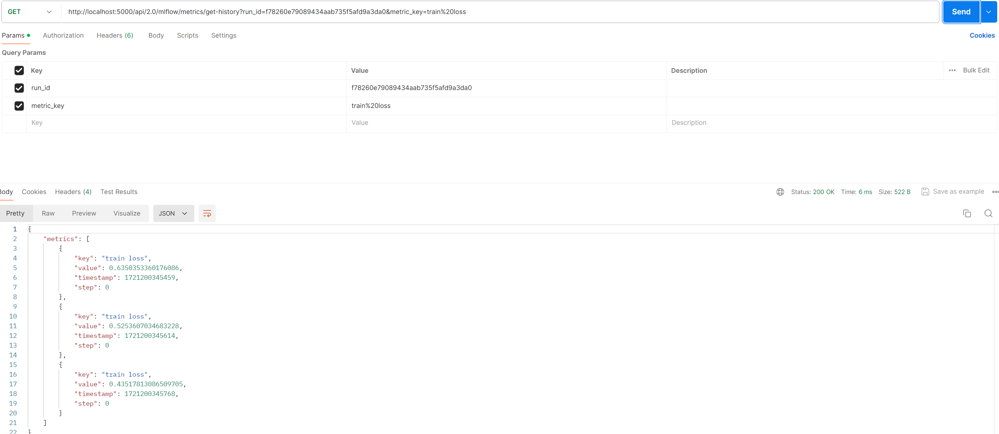

## Goal
MLflow tracking을 하는 중에 ui가 아닌 REST API로 tracking 중인 값들 가져오기

## References
code base : https://github.com/vhrehfdl/mlflow_tutorial/DL
official documentation : https://www.mlflow.org/docs/2.14.0/rest-api.html#get-run

## Study
```python
cd DL
mlflow server
```
> ui를 쓸때는 mlflow ui, REST API로 땡겨올때는 mlflow server로 구분되어있는데,  
> mlflow server로 올려도 ui로 접근가능함  
> 차이가 있는 건지 확인 필요

```python
python mlflow_tracking.py
```

Update mlflow >= 2.0.0

```python
curl 'http://localhost:5000/api/2.0/mlflow/metrics/get-history?run_id={run_id}&metric_key=train%20loss'
```
3epoch으로 돌렸을 때에 결과  


> 다음에 확인할 것
> 1. experiment list, run list, 현재 실행중인 run_id list를 가져오는 법이 있는가?
> 2. metric_key는 코드 상에서 어떻게 등록하는지, 마찬가지로 list 조회가능한지?
> 3. cli에서는 잘되는데 python 코드안에서 잘 되는지 확인


