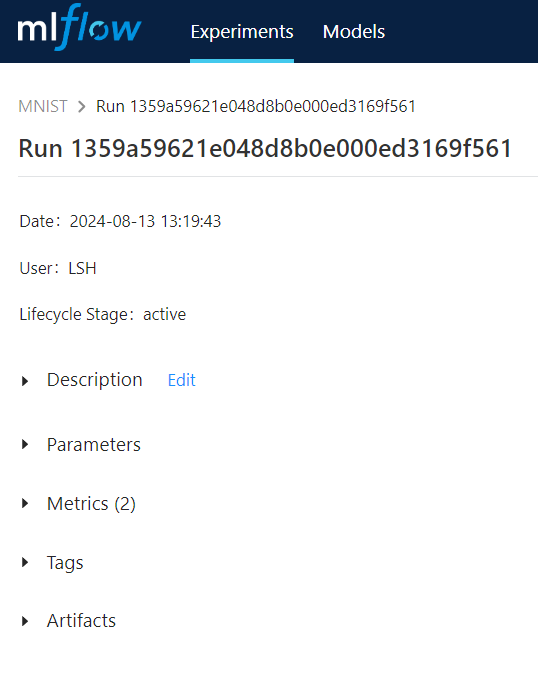

code base: https://yong0810.tistory.com/17  
MLflow tracking과 inference를 MNIST classification 코드에 적용해보기
----------------------------------------------------------------
## MLflow Tracking
  

### Description
* web ui에서 수동으로 적어주는 것으로 보임

### Parameters
* 말그대로 파라미터를 저장, 파라미터대비 최종metric을 시각화하여 보여주는 기능이 있다.
* synchronous 옵션 있음, false면 async로 동작
```python
with mlflow.start_run():
    # 단일 파라미터 로깅
    mlflow.log_param("learning_rate", 0.01)
    # dictionary로 한번에 로깅
    params_dict = {"learning_rate":0.01, "batch_size":32, "num_laayers":3}
    mlflow.log_param(params_dict)
```

### Metrics
* metric 결과값 저장, epoch대비 metric 변화량 시각화 가능
* synchronous 옵션 있음
```python
with mlflow.start_run():
    for epoch in range(10):
        # predicted_label = model(text)
        # loss = ...
        # loss.backward()
        accuracy = ...
        localization_loss, classification_loss = ...
        mlflow.log_metric("epoch_accuracy", accuracy)
        mlflow.log_metrics({"loc_loss": localization_loss, "cls_loss": classification_loss})
```

### Tags
* 협업시 각 run에 대해서 목적을 쉽게 파악하기 위한 용도 (version, 특징 등)
* synchronous 옵션 있음
```python
with mlflow.start_run():
    # 단일 태그 로깅
    mlflow.set_tag("experiment_type", "baseline")

    # dictionary로 한번에 로깅
    tags = {"version": "1.0", "team": "data-science"}
    mlflow.set_tags(tags)
```

### Artifacts
* 시각화 결과, 데이터셋, 가중치 파일 등을 저장하고 mlflow에서 link해준다.
* 클라우드 스토리지등에 저장하고, mlflow tracking이 link해줌
* local_path는 저장할 파일, artifact_path는 저장할 위치 지정 옵션

```python
# 환경 변수 설정
os.environ['MLFLOW_ARTIFACT_URI'] = 's3://my-bucket/mlflow-artifacts'
with mlflow.start_run():
    # 아티팩트를 지정한 S3 버킷의 "models" 디렉토리에 저장
    mlflow.log_artifact("output/model.pkl", artifact_path="models")
    # 디렉토리 전체 저장
    mlflow.log_artifacts("output", artifact_path="models")
```

----------------------------------------------------------------
## 그외
### autologging
* Tensorboard, scikit-learn 같은 라이브러리로 학습할때 코드에 일일히 명시하지 않아도 metrics와 params를 자동으로 저장함
* pytorch의 경우 lightning을 사용하면 사용가능한 것으로 보임
* https://mlflow.org/docs/latest/tracking/autolog.html#pytorch


----------------------------------------------------------------

> TODO
> * Artifact 저장시 MinIO 사용해야하니 공부
> * mlflow.projects.run() 확인
> * mlflow.log_model() 확인
> * mlflow.register_model() 확인
