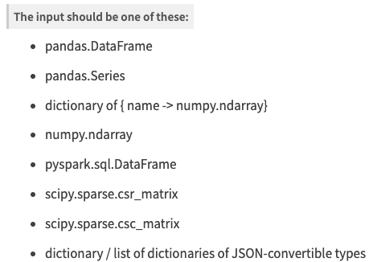
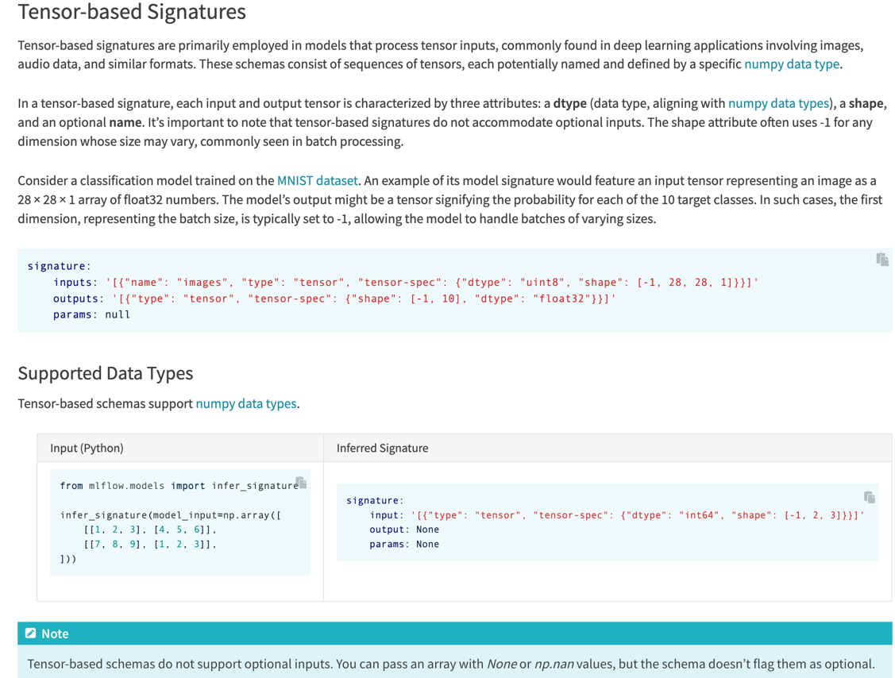

https://dailyheumsi.tistory.com/262
## mlflow models
프레임워크 별로 함수 제공한다.  
https://mlflow.org/docs/latest/python_api/mlflow.pytorch.html?highlight=log_model#mlflow.pytorch

### log_model
```python
# 로컬에 저장
mlflow.pytorch.save_model()
# run 내부에 저장
mlflow.pytorch.log_model(model, "model")
```

이 떄, 모델에 대한 시그니처(입출력 포맷)을 지정해줘야 한다.
```python
from mlflow.models.signature import infer_signature

signature = infer_signature(input_data, model(input_data))
mlflow.pytorch.log_model(model, "model", signature=signature)
```
이렇게 해주면 시그니처의 구조를 알아서 추론해서 잡아준다.   
하지만 지원하는 데이터타입에 Tensor가 없다  
  
[공식문서](https://mlflow.org/docs/latest/model/signatures.html)를 참고하니 specific한 numpy로 취급하면 된다고 한다.  
  
요약하면 가변 배치를 고려해서 1차원 늘려서 numpy로 넘기면 자동으로 처리해주겠다는 내용이다.  

```python
from mlflow.models.signature import infer_signature
input_data = next(iter(train_loader))[0][0].unsqueeze(0)
input_data_np = sample_data.numpy()
output_data_np = model(input_data).detach().numpy()
signature = infer_signature(input_data_np, output_data_np)
mlflow.pytorch.log_model(model, "model", signature=signature)
```
이렇게 처리해줬더니 load해서 inference할 때 Tensor로 넣어도 알아서 동작한다.


--------------------------------
### load_model
```python
with mlflow.start_run() as run:
    mlflow.pytorch.log_model(model, "model")
    
model_uri = f"runs:/{run.info.run_id}/model"
loaded_model = mlflow.pytorch.load_model(model_uri)
# x = data preprocessing
y_pred = loaded_model(x)

``` 
위 예시는 학습한 모델 저장 후 바로 불러오는 것이지만 추론만 따로 하려는 경우 run_id만 알고 있으면 가능하다.

